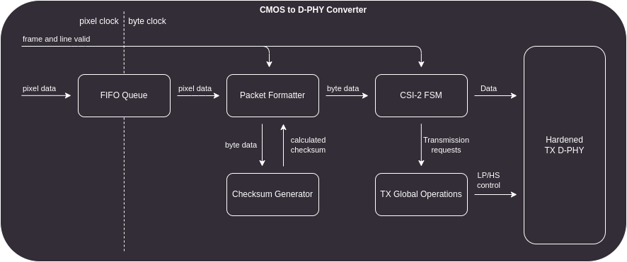
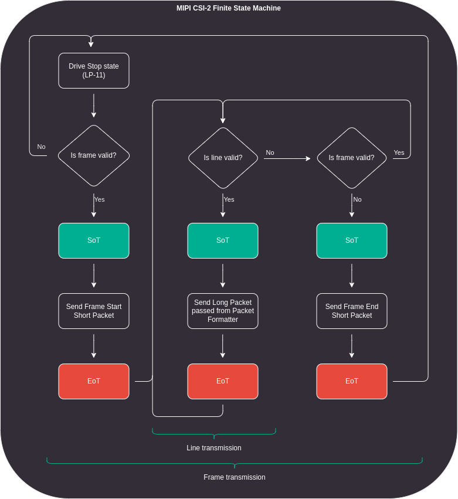
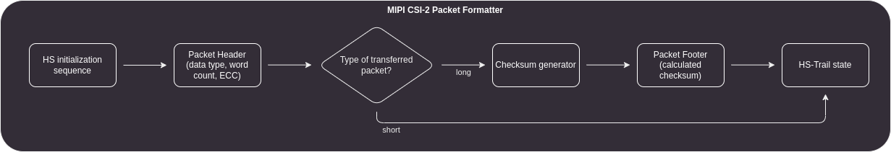
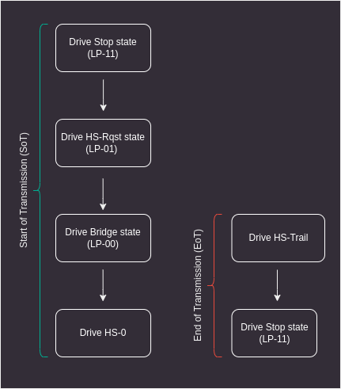
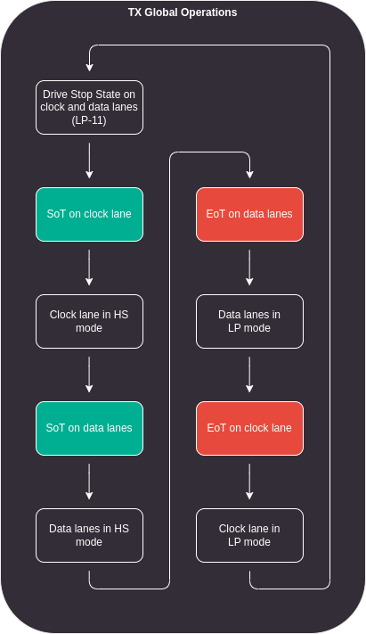

# CMOS to D-PHY converter

The SDI to MIPI CSI-2 Video Converter uses the SDI deserializer chip to decode the SDI serial stream into a 20-bit parallel stream with additional vertical and horizontal synchronization signals.
The 20-bit parallel data consists of two 10-bit words defining the luminance and chrominance components of the YCbCr color space.
Each of these components is directly connected to the FPGA input pins.
The CMOS to D-PHY converter module synchronizes to frame and line valid signals, then passes the data from the deserializer to the MIPI D-PHY, following the MIPI CSI-2 protocol.

## Architecture

The CMOS to D-PHY converter is capable of generating MIPI CSI-2 packets and switching MIPI D-PHY link modes.
It consists of the following modules:
1. [CSI-2 Finite State Machine](#mipi-csi-2-finite-state-machine) - FSM that controls MIPI CSI-2 protocol flow, assuming input signals `FVAL`/`LVAL` it transmits frames one by one.
Underlying modules are synchronized between each other in each FSM state to strictly follow MIPI CSI-2 protocol.
2. [Packet Formatter](#packet-formatter) (Low Level Protocol) - MIPI CSI-2 packet generator, it generates SoT (Start of Transmission), EoT (End of Transmission), header and footer for each packet.
3. [Checksum generator](#checksum-generator) - combinatorial CRC16 checksum generator.
4. [TX Global Operations](#tx-global-operations) - controls D-PHY interface lanes switching between Low Power (LP) and High Speed (HS) modes.
5. [Hardened TX D-PHY](#hardened-tx-d-phy) - the MIPI D-PHY interface provided by the FPGA fabric, configured to operate as a transmitter, controlled by TX Global Operations.

:::{figure-md}

CMOS to D-PHY IP Core design
:::

## MIPI CSI-2 Finite State Machine

The MIPI CSI-2 Finite State Machine (FSM) is designed to synchronize other modules with each other.
That means, this module is not strictly a part of the MIPI CSI-2 protocol.
The FSM synchronizes to the beginning of the frame and then initiates D-PHY packet transfers while controlling the Packet Formatter, the Checksum Generator and the TX Global Operations modules.
The diagram below illustrates the FSM flow during device operation.

:::{figure-md}

MIPI CSI-2 Finite State Machine flow diagram
:::

## Packet Formatter

The MIPI CSI-2 protocol transmits input data in a protocol specific packets. There are two main types of packets:
1. Short packets - used for line and frame synchronization.
While line start and end packets are optional, frame synchronization is mandatory.
A short packet is a 32-bit word consisting of Data ID, Word Count and computed Error Correction Code (ECC).
2. Long packets - consist of packet header, payload and packet footer.
The packet header is generated using exactly the same rules as the short packet.
The payload is generated from pixels packed into single bytes and sent one by one between the header and the footer.
In the case of the YUV422 8-bit data type, no additional pixel-to-byte conversion is required and the pixels are passed directly to the payload field.
Each byte is simultaneously passed to the payload and to the CRC checksum generator.
The calculated checksum is transmitted as the packet footer at the end of each long packet transmission.

Each packet starts with an initialization sequence (single byte `0xb8` on each line) and ends with the HS-Trail state (inverted MSB of the last transferred byte).
The packet formatter module itself does not control the data input to the D-PHY interface.
It generates the initialization sequence, header, footer, and HS-Trail state, but it is the task of a supervisor to forward these generated values.
The diagram below visualizes the internal flow of the packet formatter for each requested packet.

:::{figure-md}

Packet Formatter IP Core flow diagram
:::

### Data ID

The Data Identifier is a single byte consisting of a 2-bit virtual channel identifier and a 6-bit data type.
The data type is equal to `0x1e` for YUV422 8-bit format.
In case of frame synchronization packets it must be set to `0x0` or `0x1` for frame start and frame end packets respectively.

### Word Count

The Word Count value should be zero when transmitting short packets, unless there is a need to attach any embedded data.
For long packets, this value must indicate the number of individual bytes to be transmitted.

### ECC Generator

The Error Correction Code (ECC) is a Hamming code calculated from the Data ID and the Word Count (WC).
The Hamming code is generated for 6 bits, with the two most significant bits set to 0.

## Checksum Generator

In order to detect any errors during the payload transmission, a checksum is calculated over each data packet.
The checksum is a 16-bit CRC defined by a polynomial x{sup}`16`+x{sup}`12`+x{sup}`5`+x{sup}`0` with an initial state set to `0xffff`.
The generator shift direction is assumed to be little endian.

## TX Global Operations

The MIPI D-PHY interface is capable of switching between HS and LP modes.
Each switch between these modes must follow a precise sequence of either Start of Transmission (SoT) to enter HS mode or End of Transmission (EoT) to enter LP mode.
The High Speed mode is referred to as the transmission mode because it is used to transmit or receive either large chunks of data or synchronization packets.

:::{figure-md}

Start and End of CSI-2 transmission
:::

The TX Global Operations can be controlled by sending transfer requests and validating byte data.
It generates signals that should be connected directly to the hardened D-PHY module.
The figure below visualizes an example of switching from LP to HS and back from HS to LP on the D-PHY interface.

:::{figure-md}

TX Global Operations module flow
:::

## Hardened TX D-PHY

The Lattice Crosslink-NX FPGA devices have hardened MIPI D-PHY modules that can be instantiated by the user.
These interfaces support the MIPI CSI-2 and MIPI DSI protocols for Tx and Rx devices with unidirectional HS and bidirectional LP modes.
The hardened D-PHY blocks deserialize and serialize data into byte data packets and distribute them between 1, 2, 3 or 4 supported lanes.
The MIPI D-PHY modules available on Crosslink-NX include an internal PLL that generates the clock for both byte and D-PHY HS domains.

For CMOS to D-PHY converting purposes, hardened D-PHY is configured to work as a transmitter in MIPI CSI-2 protocol.
